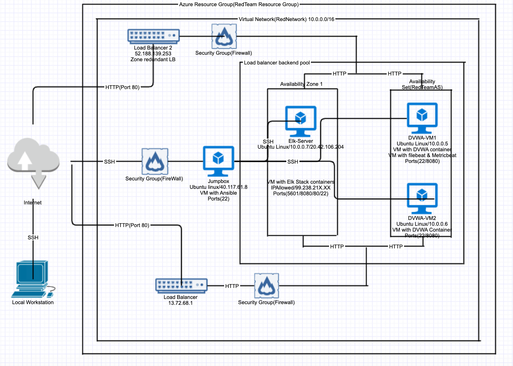

## Automated ELK Stack Deployment

The files in this repository were used to configure the network depicted below.

These files have been tested and used to generate a live ELK deployment on Azure. They can be used to either recreate the entire deployment pictured above. Alternatively, select portions of the Filebeat-playbook.yml file may be used to install only certain pieces of it, such as Filebeat.

  - filebeat-playbook.yml,metricbeat-playbook.yml,install-elk.yml

This document contains the following details:
- Description of the Topology
- Access Policies
- ELK Configuration
- Beats in Use
- Machines Being Monitored
- How to Use the Ansible Build

### Description of the Topology

The main purpose of this network is to expose a load-balanced and monitored instance of DVWA, the D*mn Vulnerable Web Application.

Load balancing ensures that the application will be highly available, in addition to restricting access to the network.
- Load balancing will protect from the denial of service attack as it will help to divert the traffic and to distribute the load.
  Moreover, It helps with the intrusion prevention by restricting access to the servers holding the application.
  A jump box provides a controlled access to the servers/VMs holding the applications and helps with the management of these hosts.

Integrating an ELK server allows users to easily monitor the vulnerable VMs for changes to the files and system metrics.
- Filebeat watches for the changes in the files in the locations that we specify or the log files and then collects and send the data to logstash/elasticsearch.
- Metricbeat collects the metric data from the services and the operating system and sends it to logstash/elasticsearch

The configuration details of each machine may be found below.

| Name       | Function                                              | IP address                              | Operating System        |
|------------|-------------------------------------------------------|-----------------------------------------|-------------------------|
| Jumpbox    | Gateway with ansible container                        | 40.117.61.8                             | Ubuntu 18.04 Server LTS |
| Elk-Server | osts Elk stack container                              | 20.42.106.204(Public) 10.0.0.7(Private) | Ubuntu 18.04 Server LTS |
| DVWA-VM1   | Hosts DVWA Container Contains Filebeat and Metricbeat | 10.0.0.5                                | Ubuntu 18.04 Server LTS |
| DVWA-VM2   | Hosts DVWA Container(backup for DVWA)                 | 10.0.0.6                                | Ubuntu 18.04 Server LTS |

### Access Policies

The machines on the internal network are not exposed to the public Internet. 

Only the Jumpbox machine can accept connections from the Internet. Access to this machine is only allowed from the following IP addresses:
- 99.238.21X.XX

Machines within the network can only be accessed by Jumpbox
- Jumpbox with the IP address 40.117.61.8 with the ansible container can access the Elk server

A summary of the access policies in place can be found in the table below.

| Name       | Publicly Accessible | Allowed Ip addresses |
|------------|---------------------|----------------------|
| Jump Box   | yes                 | 99.238.21X.XX        |
| Elk-Server | No                  |                      |
| DVWA-VM1   | No                  |                      |
| DVWA-VM2   | No                  |                      |

### Elk Configuration

Ansible was used to automate configuration of the ELK machine. No configuration was performed manually, which is advantageous because...
- In case we need to configure more machines,we can just run the ansible playbook instead of going to every machine and configuring individually.

The playbook implements the following tasks:
- Install docker.io
- Install PIP
- Install docker python module
- Download and Install a Docker elk container
- run command to increase the memory

The following screenshot displays the result of running `docker ps` after successfully configuring the ELK instance.

### Target Machines & Beats
This ELK server is configured to monitor the following machines:
- DVWA-VM1(10.0.0.5)

We have installed the following Beats on these machines:
- Filebeat and Metricbeat

These Beats allow us to collect the following information from each machine:
- Filebeat watches for the changes in the files in the locations that we specify or the log files and then collects and send the data to logstash/elasticsearch for example the modifications in a file.
- Metricbeat collects the metric data from the services and the operating system and sends it to logstash/elasticsearch such as Apache service

### Using the Playbook
In order to use the playbook, you will need to have an Ansible control node already configured. Assuming you have such a control node provisioned: 

SSH into the control node and follow the steps below:
- Copy the filebeat-playbook.yml and metricbeat-playbook.yml files to /etc/ansible/roles.
- Update the /etc/ansible/hosts file to include the ip address of the machine under webservers
- Run the playbook, and navigate to http://20.42.106.204:5601/ to check that the installation worked as expected.

_As a **Bonus**, provide the specific commands the user will need to run to download the playbook, update the files, etc.

Before running the playbook, we need to make sure that the private IP of elk server is added to the ansible hosts file under elkservers group.
nano /etc/ansible/hosts command is used to edit the hosts file

Below command is used to increase the memory

sysctl -w vm.max_map_count=262144 . This improves the performance of Elk server.

For Filebeats following needs to be added in the playbook
curl -L -O https://artifacts.elastic.co/downloads/beats/filebeat/filebeat-7.6.2-amd64.deb
sudo dpkg -i filebeat-7.6.2-amd64.deb
copy filebeat.yml from /etc/ansible/files/filebeat.yml(ansible) to /etc/metricbeat/filebeat.yml(Webserver)
filebeat modules enable system
filebeat setup
service filebeat start

For Metricbeats following needs to be added in the playbook

curl -L -O https://artifacts.elastic.co/downloads/beats/metricbeat/metricbeat-7.6.2-amd64.deb
sudo dpkg -i metricbeat-7.6.2-amd64.deb
copy metricbeat.yml from /etc/ansible/files/metricbeat.yml(ansible) to /etc/metricbeat/metricbeat.yml(Webserver)
metricbeat modules enable system
metricbeat setup
service metricbeat start

Roles have been created for the filebeat and metricbeat and their corresponding playbooks are represented by main_filebeat.yml and main_metricbeat.yml and the playbook using these roles is beatroles.yml

Note: we need to make sure that the firewall rules are as restrictive as possible.
